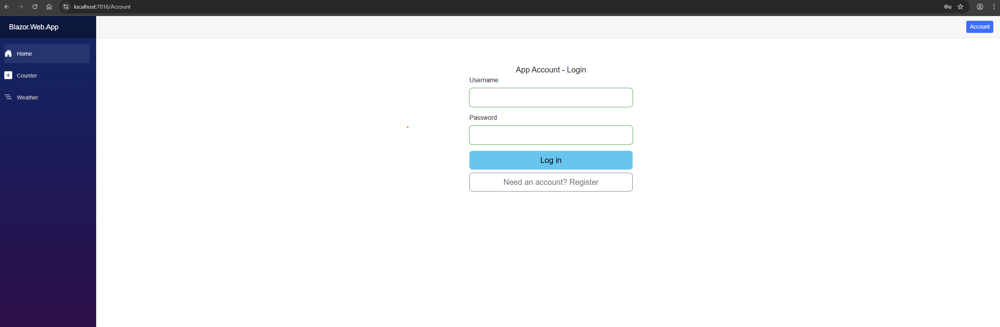

# Blazor.Web - Frontend Application

<p align="center">
  
  
  
  
</p>

---

## Overview

The **Blazor.Web** solution provides a modern, interactive frontend built with Blazor WebAssembly. It implements clean architecture principles with proper layering, custom authentication state management, and seamless API integration.

> This frontend is designed to work with the [Blueprint.API](../Blueprint.API/README.md) backend.

---

## Project Structure

```
Blazor.Web/
|-- Blazor.Web/                    # Main Blazor Server Host
|   |-- Components/
|   |   |-- Layout/                # MainLayout, NavMenu
|   |   |-- Pages/                 # Account, Home, etc.
|   |   `-- Shared/                # Reusable components (Modals)
|   |-- Auth/                      # Authentication state providers
|   |   `-- CustomAuthStateProvider.cs
|   `-- Program.cs
|-- Blazor.Web.Client/             # WASM Client Project
|   `-- Program.cs
|-- Blazor.Web.Logic/              # Business Logic Layer
|   `-- Services/                  # Application services
|-- Blazor.Web.Repository/         # Data Access Layer
|   `-- ApiClient/                 # HTTP client for API calls
|-- Blazor.Web.Models/             # Frontend-specific models
|-- Blazor.Web.Domain/             # Domain interfaces
`-- Blazor.Web.Test/               # Unit tests
```

---

## Quick Start

### Prerequisites

- [.NET 10.0 SDK](https://dotnet.microsoft.com/download/dotnet/10.0)
- Running instance of [Blueprint.API](../Blueprint.API/README.md)

### 1. Configure the Application

```bash
cd Blazor.Web

# Set JWT configuration (must match API settings)
dotnet user-secrets set "Jwt:Key" "your-secure-secret-key-at-least-32-characters-long"
dotnet user-secrets set "Jwt:Issuer" "App.Web.App"
dotnet user-secrets set "Jwt:Audience" "App.Web.App"
```

Or use Visual Studio:
1. Right-click **Blazor.Web** project
2. Select **Manage User Secrets**
3. Add your configuration to `secrets.json`

### 2. Ensure API is Running

The frontend requires the API to be running:

```bash
# In a separate terminal
cd ../Blueprint.API/Blueprint.API
dotnet run
```

### 3. Run the Web Application

```bash
cd Blazor.Web
dotnet run
```

The application will be available at: **https://localhost:7016**

---

## Features

### Authentication

- Custom `AuthenticationStateProvider` for JWT token management
- Automatic token persistence in browser storage
- Protected routes with `[Authorize]` attribute
- Login/Register forms with validation

### Components

| Component | Purpose |
|-----------|---------|
| `MainLayout` | Application shell with navigation |
| `NavMenu` | Side navigation with auth-aware links |
| `Account` | Login and registration page |
| `Modal` | Reusable modal dialog component |

### Render Modes

The application supports both:
- **Interactive Server** - Server-side rendering with SignalR
- **Interactive WebAssembly** - Client-side rendering

---

## Architecture

### Layer Responsibilities

| Layer | Project | Responsibility |
|-------|---------|----------------|
| **Presentation** | Blazor.Web | Razor components, pages, UI |
| **Logic** | Blazor.Web.Logic | Business services, validation |
| **Repository** | Blazor.Web.Repository | HTTP client, API communication |
| **Models** | Blazor.Web.Models | Frontend-specific models |
| **Shared** | Template.Models | Shared DTOs with API |

### Authentication Flow

```
+-------------------+     +------------------------+     +-------------+
|   Login Page      |---->| CustomAuthStateProvider |---->|   API       |
+-------------------+     +------------------------+     +-------------+
         |                        |                         |
         |                        |  POST /api/Auth/login   |
         |                        |------------------------>|
         |                        |                         |
         |                        |  { token, user }        |
         |                        |<------------------------|
         |                        |                         |
         |  Store token           |                         |
         |  Update auth state     |                         |
         |<-----------------------|                         |
         |                        |                         |
         |  Redirect to Home      |                         |
         |                        |                         |
```

---

## Configuration

### appsettings.json

```json
{
  "Logging": {
    "LogLevel": {
      "Default": "Information",
      "Microsoft.AspNetCore": "Warning"
    }
  },
  "AllowedHosts": "*",
  "ApiBaseUrl": "https://localhost:7115"
}
```

### Required User Secrets

| Key | Description |
|-----|-------------|
| `Jwt:Key` | JWT signing key (must match API) |
| `Jwt:Issuer` | Token issuer identifier |
| `Jwt:Audience` | Token audience identifier |

---

## Pages

### Account Page (`/Account`)

Handles both login and registration:

- Toggle between Login and Register modes
- Real-time form validation
- Error message display
- Automatic redirect on success

### Home Page (`/`)

- Protected route requiring authentication
- Displays user information
- Navigation to other features

---

## Components

### Modal Component

Reusable modal dialog for confirmations and forms:

```razor
<Modal @ref="modal" Title="Confirm Action">
    <p>Are you sure you want to proceed?</p>
</Modal>

@code {
    private Modal modal = default!;
    
    private async Task ShowModal()
    {
        await modal.ShowAsync();
    }
}
```

### NavMenu Component

Authentication-aware navigation:

```razor
<AuthorizeView>
    <Authorized>
        <NavLink href="dashboard">Dashboard</NavLink>
        <button @onclick="Logout">Logout</button>
    </Authorized>
    <NotAuthorized>
        <NavLink href="Account">Login</NavLink>
    </NotAuthorized>
</AuthorizeView>
```

---

## HTTP Client Setup

### API Communication

The repository layer handles all API calls:

```csharp
public class AuthRepository : IAuthRepository
{
    private readonly HttpClient _httpClient;
    
    public async Task<AuthResponseDto> LoginAsync(LoginUserDto dto)
    {
        var response = await _httpClient.PostAsJsonAsync("api/Auth/login", dto);
        return await response.Content.ReadFromJsonAsync<AuthResponseDto>();
    }
}
```

### Service Registration

```csharp
// Program.cs
builder.Services.AddHttpClient<IAuthRepository, AuthRepository>(client =>
{
    client.BaseAddress = new Uri(builder.Configuration["ApiBaseUrl"]!);
});
```

---

## Testing

### Running Tests

```bash
cd Blazor.Web.Test
dotnet test
```

### Test Areas

| Area | Tests |
|------|-------|
| Components | Render tests, user interactions |
| Services | Business logic validation |
| Repository | HTTP client mocking |

---

## Styling

### Bootstrap Integration

The application uses Bootstrap 5 for styling:

- Responsive grid layout
- Form components and validation styles
- Navigation components
- Modal dialogs

### Custom Styles

Add custom styles in:
- `wwwroot/css/app.css` - Global styles
- Component-specific `<style>` blocks

---

## Troubleshooting

### Common Issues

| Issue | Solution |
|-------|----------|
| "Failed to connect to API" | Ensure Blueprint.API is running on port 7115 |
| "401 Unauthorized" | Check JWT configuration matches between projects |
| "CORS error" | Verify API CORS settings include web app origin |
| "Token expired" | Login again to get a new token |

### Debug Mode

Enable detailed logging:

```json
{
  "Logging": {
    "LogLevel": {
      "Default": "Debug",
      "Microsoft.AspNetCore": "Information"
    }
  }
}
```

---

## Screenshots

> Add screenshots to `docs/images/` folder at the repository root.

### Login Page


### Registration


### Dashboard


---

## Related Documentation

- [Root README](../README.md) - Full project overview
- [Blueprint.API README](../Blueprint.API/README.md) - Backend documentation
- [Microsoft Blazor Docs](https://docs.microsoft.com/aspnet/core/blazor/)

---

## License

This project is part of the [Blazor WASM + API Starter Template](../README.md) and is licensed under the MIT License.
