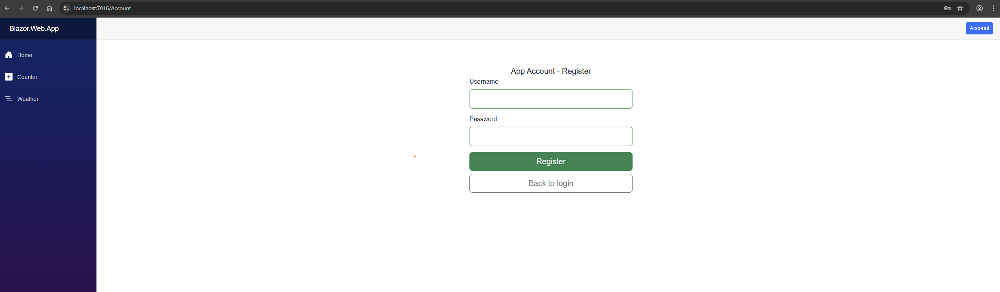
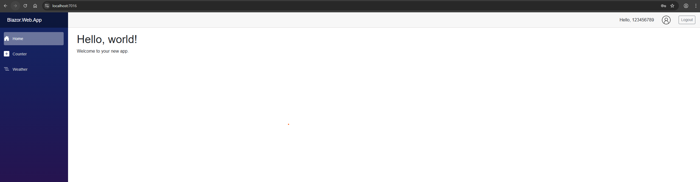
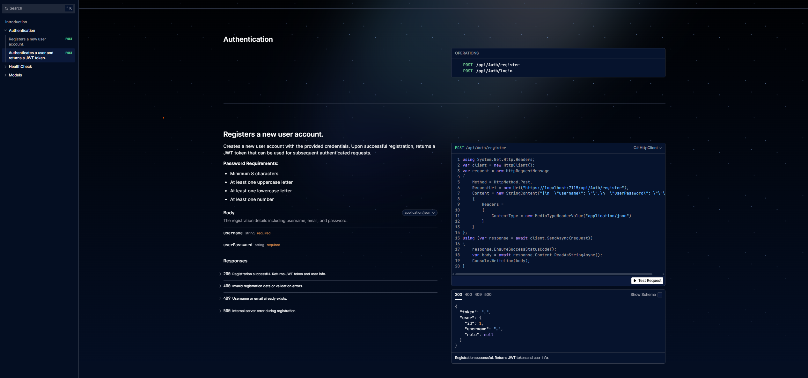
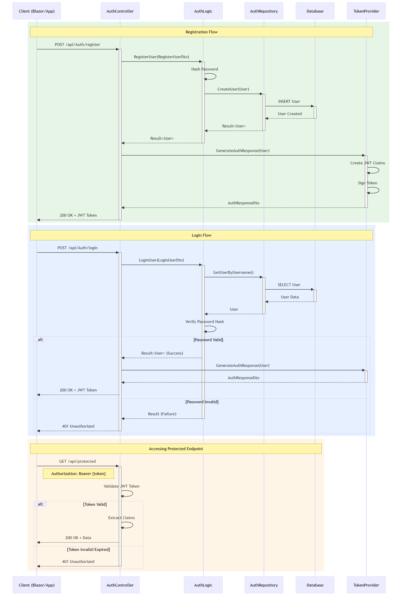

# Blazor WASM + .NET Core API Starter Template

<p align="center">
  <strong>Enterprise-grade starter template for Blazor WebAssembly + .NET Core API</strong><br>
  Implements SOLID principles, clean architecture, JWT authentication, and proper layering.
</p>

<p align="center">
  
  
  
  
  
</p>

---

## Table of Contents

- [Overview](#overview)
- [Architecture](#architecture)
- [Features](#features)
- [Solution Structure](#solution-structure)
- [Getting Started](#getting-started)
- [Configuration](#configuration)
- [Screenshots](#screenshots)
- [API Documentation](#api-documentation)
- [Roadmap](#roadmap)
- [Contributing](#contributing)
- [License](#license)

---

## Overview

This repository contains a **production-ready starter template** designed to accelerate the development of enterprise applications using **Blazor WebAssembly** for the frontend and **.NET Core Web API** for the backend.

### Why This Template?

Building enterprise applications from scratch often means reinventing the wheel—setting up authentication, structuring projects, implementing patterns, and wiring dependencies. This template eliminates that overhead by providing:

- **Battle-tested architecture** following SOLID principles
- **Secure JWT authentication** out of the box
- **Clean separation of concerns** with proper layering
- **Shared models** between frontend and backend
- **Ready-to-extend** foundation for real-world applications

### Who Is This For?

- Developers starting new Blazor + API projects
- Teams wanting a consistent, scalable architecture
- Anyone learning clean architecture patterns in .NET

---

## Architecture

This template follows **Clean Architecture** principles with clear separation between layers:

```
+------------------------------------------------------------------+
|                         PRESENTATION                             |
|  +-------------------------+    +-----------------------------+  |
|  |      Blazor.Web         |    |      Blueprint.API          |  |
|  |   (Blazor WASM Client)  |<-->|    (REST API Controllers)   |  |
|  +-------------------------+    +-----------------------------+  |
+------------------------------------------------------------------+
                                  |
                                  v
+------------------------------------------------------------------+
|                        BUSINESS LOGIC                            |
|  +-------------------------+    +-----------------------------+  |
|  |    Blazor.Web.Logic     |    |   Blueprint.API.Logic       |  |
|  |   (Services/Validators) |    |  (Business Rules/Services)  |  |
|  +-------------------------+    +-----------------------------+  |
+------------------------------------------------------------------+
                                  |
                                  v
+------------------------------------------------------------------+
|                         DATA ACCESS                              |
|  +-------------------------+    +-----------------------------+  |
|  |  Blazor.Web.Repository  |    | Blueprint.API.Repository    |  |
|  |   (API Client/HTTP)     |    |    (Database Access)        |  |
|  +-------------------------+    +-----------------------------+  |
+------------------------------------------------------------------+
                                  |
                                  v
+------------------------------------------------------------------+
|                           SHARED                                 |
|  +------------------------------------------------------------+  |
|  |                    Template.Models                         |  |
|  |              (DTOs, Models, Shared Contracts)              |  |
|  +------------------------------------------------------------+  |
+------------------------------------------------------------------+
```

### Key Architectural Decisions

| Decision | Rationale |
|----------|-----------|
| **Layered Architecture** | Ensures testability and maintainability |
| **Repository Pattern** | Abstracts data access, enables mocking |
| **Dependency Injection** | Loose coupling, easy testing |
| **Shared Models Project** | Single source of truth for DTOs |
| **CQRS-lite in Repository** | Separates read/write concerns |

---

## Features

This template is built with a heavy focus on **Clean Architecture** and **object-oriented design (OOD/OOP)**—favouring **composition over inheritance**, clear boundaries, and dependency inversion to keep the codebase testable, maintainable, and easy to extend.

> “The architecture of a software system is the shape given to that system by those who build it.” — Robert C. Martin (Uncle Bob)

### Authentication and Security
- JWT Bearer token authentication
- Secure password hashing with ASP.NET Identity
- Token persistence and session management
- Custom `AuthenticationStateProvider` for Blazor
- Protected routes with `[Authorize]` attributes

### Validation
- **FluentValidation** for enterprise-level input validation
- Centralised validation constants for consistent rules
- Password complexity requirements (uppercase, lowercase, digit, special character)
- Username format validation (alphanumeric, length constraints)
- Direct validator injection via dependency injection

### API Features
- RESTful API design
- OpenAPI documentation with Scalar.AspNetCore and Microsoft.AspNetCore.OpenApi (with JWT support)
- Health check endpoints
- Structured logging with Serilog
- CORS configuration

### Frontend Features
- Blazor WebAssembly with Interactive Server/WASM modes
- Form validation with real-time feedback
- Responsive Bootstrap UI
- Anonymous/Authenticated route handling
- Modal components for user interactions

### Testing
- Unit test projects included for both solutions
- Clean architecture enables easy mocking
- Repository pattern supports testable data access

### Code Quality
- SOLID principles throughout
- Consistent naming conventions
- XML documentation for public APIs
- Clean separation of concerns

### Design Patterns and Architectural Practices
- **Clean Architecture** with strict layering and dependency direction towards the domain
- **Dependency Injection (DI)** for loose coupling and testability
- **Repository pattern** to abstract data access and enable mocking in tests
- **CQRS-lite** approach (separating reads and writes) within the repository layer
- **Options pattern** for strongly-typed configuration
- **Composition over inheritance** to build behaviour from small, focused units
- **FluentValidation** for declarative, testable validation rules

---

## Solution Structure

This repository contains **two solutions** that work together:

### Blazor.Web Solution (Frontend)

```
Blazor.Web/
|-- Blazor.Web/                    # Main Blazor Server host
|   |-- Components/                # Razor components
|   |   |-- Layout/                # MainLayout, NavMenu
|   |   |-- Pages/                 # Account, Home, etc.
|   |   +-- Shared/                # Reusable components (Modals)
|   |-- Auth/                      # Auth state providers
|   +-- Program.cs                 # Application entry point
|-- Blazor.Web.Client/             # WASM client project
|-- Blazor.Web.Domain/             # Domain interfaces and contracts
|-- Blazor.Web.Logic/              # Business logic and services
|-- Blazor.Web.Models/             # Frontend-specific models
|-- Blazor.Web.Repository/         # HTTP client and API access
+-- Blazor.Web.Test/               # Unit tests
```

### Blueprint.API Solution (Backend)

```
Blueprint.API/
|-- Blueprint.API/                 # API host project
|   |-- Controllers/               # REST endpoints
|   |   |-- AuthController.cs      # Login/Register
|   |   |-- ItemController.cs      # Sample CRUD
|   |   |-- ItemTypesController.cs
|   |   +-- HealthCheckController.cs
|   |-- Configuration/             # Service extensions
|   +-- Program.cs                 # Application entry point
|-- Blueprint.API.Domain/          # Domain interfaces
|-- Blueprint.API.Logic/           # Business rules and services
|-- Blueprint.API.Models/          # API-specific models
|-- Blueprint.API.Repository/      # Database access (CQRS)
|   +-- AuthRepository/
|       |-- Commands/              # Write operations
|       +-- Queries/               # Read operations
+-- Blueprint.API.Test/            # Unit tests
```

### Shared Project

```
Shared/
+-- Template.Models/               # Shared DTOs and contracts
    |-- Dtos/                      # Data transfer objects
    +-- Models/                    # Shared domain models
```

---

## Getting Started

### Prerequisites

- [.NET 10.0 SDK](https://dotnet.microsoft.com/download/dotnet/10.0) or later
- [Visual Studio 2022](https://visualstudio.microsoft.com/) (recommended) or VS Code
- SQL Server (LocalDB or full instance) *if using database features*

### Installation

1. **Clone the repository**
   ```bash
   git clone https://github.com/sys-MWell/BlazorWASM-API-Starter.git
   cd BlazorWASM-API-Starter
   ```

2. **Restore dependencies**
   ```bash
   # Restore API solution
   dotnet restore Blueprint.API/Blueprint.API.sln
   
   # Restore Web solution
   dotnet restore Blazor.Web/Blazor.Web.slnx
   ```

3. **Configure the applications** (see [Configuration](#configuration))

4. **Run the API** (Terminal 1)
   ```bash
   cd Blueprint.API/Blueprint.API
   dotnet run
   ```
   The API will be available at `https://localhost:7115`

5. **Run the Web App** (Terminal 2)
   ```bash
   cd Blazor.Web/Blazor.Web
   dotnet run
   ```
   The Web App will be available at `https://localhost:7016`

### Running in Visual Studio

1. Open both solutions in separate Visual Studio instances, **OR**
2. Create a solution folder containing both `.sln` files
3. Set multiple startup projects:
   - `Blueprint.API` ? Start
   - `Blazor.Web` ? Start
4. Press **F5** to run both applications

---

## Configuration

### API Configuration 

> **Note:** The connection string and JWT settings are **not** hardcoded in `appsettings.json` for better security. See [Database Configuration](#database-configuration) and [JWT Configuration](#jwt-configuration) below.

### Database Configuration

This template uses **SQL Server Express LocalDB** for local development. For improved security, the database connection string is managed through **Connected Services** in Visual Studio rather than being hardcoded in `appsettings.json`.

#### Connection String Location

The connection string is stored as a Connected Services dependency with:
- **Key:** `ConnectionStrings:DatabaseConnection`
- **Format:** `Server=(localdb)\mssqllocaldb;Database=aspnet-{guid};Trusted_Connection=True;MultipleActiveResultSets=true`

#### Setting Up Your Database

**Option 1: Using Connected Services (Recommended)**
1. In Visual Studio, right-click on `Blueprint.API` project
2. Select **Add** > **Connected Service**
3. Choose **SQL Server Database** 
4. Configure your LocalDB connection
5. The connection string will be automatically managed securely

**Option 2: Using User Secrets (Alternative)**
```bash
cd Blueprint.API/Blueprint.API
dotnet user-secrets set "ConnectionStrings:DatabaseConnection" "Server=(localdb)\mssqllocaldb;Database=YourDatabaseName;Trusted_Connection=True;MultipleActiveResultSets=true"
```

**Option 3: Environment Variables (Production)**
```bash
# For production deployment
export ConnectionStrings__DatabaseConnection="Your-Production-Connection-String"
```

> **Why not hardcode in appsettings.json?**  
> Storing connection strings in Connected Services or User Secrets prevents accidental exposure of database credentials in version control, following security best practices.

### JWT Configuration

For improved security, JWT settings are managed through **Connected Services** (secrets.json) in Visual Studio rather than being hardcoded in `appsettings.json`. This applies to both the API and Web projects.

#### JWT Settings Location

The JWT configuration is stored in secrets.json via Connected Services:

**API Project (`Blueprint.API`):**
- `Jwt:Key` - Your secure secret key (minimum 32 characters)
- `Jwt:Issuer` - Token issuer (e.g., "AppAPI")
- `Jwt:Audience` - Token audience (e.g., "AppAPIUsers")
- `Jwt:ExpiresInMinutes` - Token expiration time

**Web Project (`Blazor.Web`):**
- `Jwt:Key` - Your secure secret key (minimum 32 characters)
- `Jwt:Issuer` - Token issuer (e.g., "App.Web.App")
- `Jwt:Audience` - Token audience (e.g., "App.Web.App")

#### Setting Up JWT Configuration

**Option 1: Using Connected Services (Recommended)**
1. In Visual Studio, right-click on the project (`Blueprint.API` or `Blazor.Web`)
2. Select **Manage User Secrets**
3. Add the JWT configuration to the opened `secrets.json`.

> **Note:** JWT settings for the Web project are stored in secrets.json. See [JWT Configuration](#jwt-configuration) above.

### Important Security Notes

- **Never commit real secrets** to version control
- Use [User Secrets](https://docs.microsoft.com/en-us/aspnet/core/security/app-secrets) for development
- Use Connected Services or Azure Key Vault for connection strings and JWT settings
- Use environment variables for production deployments
- Ensure JWT keys are at least 32 characters for security

---

## Screenshots

### Login Page


### Register Page


### Home Dashboard


### Scalar API Documentation


### API Authentication Flow

```
sequenceDiagram
    participant Client as Client (Blazor/App)
    participant API as AuthController
    participant Logic as AuthLogic
    participant Repo as AuthRepository
    participant DB as Database
    participant Token as TokenProvider

    %% Registration Flow
    rect rgb(230, 245, 230)
        Note over Client,Token: Registration Flow
        Client->>+API: POST /api/Auth/register
        API->>+Logic: RegisterUser(RegisterUserDto)
        Logic->>Logic: Hash Password
        Logic->>+Repo: CreateUser(User)
        Repo->>+DB: INSERT User
        DB-->>-Repo: User Created
        Repo-->>-Logic: Result<User>
        Logic-->>-API: Result<User>
        API->>+Token: GenerateAuthResponse(User)
        Token->>Token: Create JWT Claims
        Token->>Token: Sign Token
        Token-->>-API: AuthResponseDto
        API-->>-Client: 200 OK + JWT Token
    end

    %% Login Flow
    rect rgb(230, 240, 255)
        Note over Client,Token: Login Flow
        Client->>+API: POST /api/Auth/login
        API->>+Logic: LoginUser(LoginUserDto)
        Logic->>+Repo: GetUserByUsername()
        Repo->>+DB: SELECT User
        DB-->>-Repo: User Data
        Repo-->>-Logic: User
        Logic->>Logic: Verify Password Hash
        alt Password Valid
            Logic-->>API: Result<User> (Success)
            API->>+Token: GenerateAuthResponse(User)
            Token-->>-API: AuthResponseDto
            API-->>Client: 200 OK + JWT Token
        else Password Invalid
            Logic-->>-API: Result (Failure)
            API-->>-Client: 401 Unauthorized
        end
    end

    %% Using Token
    rect rgb(255, 245, 230)
        Note over Client,DB: Accessing Protected Endpoint
        Client->>+API: GET /api/protected
        Note right of Client: Authorization: Bearer {token}
        API->>API: Validate JWT Token
        alt Token Valid
            API->>API: Extract Claims
            API-->>Client: 200 OK + Data
        else Token Invalid/Expired
            API-->>-Client: 401 Unauthorized
        end
    end
```

---

## API Documentation

When running in Development mode, the API exposes OpenAPI documentation powered by **Scalar.AspNetCore** and **Microsoft.AspNetCore.OpenApi** at:

```
https://localhost:7115/scalar/v1
```

### Available Endpoints

| Method | Endpoint | Description | Auth Required |
|--------|----------|-------------|---------------|
| `POST` | `/api/Auth/register` | Register new user | No |
| `POST` | `/api/Auth/login` | Authenticate user | No |
| `GET` | `/health` | Health check | No |

---

## License

This project is licensed under the MIT License - see the [LICENSE](LICENSE) file for details.

---

## Support

- [Open an issue](https://github.com/sys-MWell/BlazorWASM-API-Starter/issues)
---